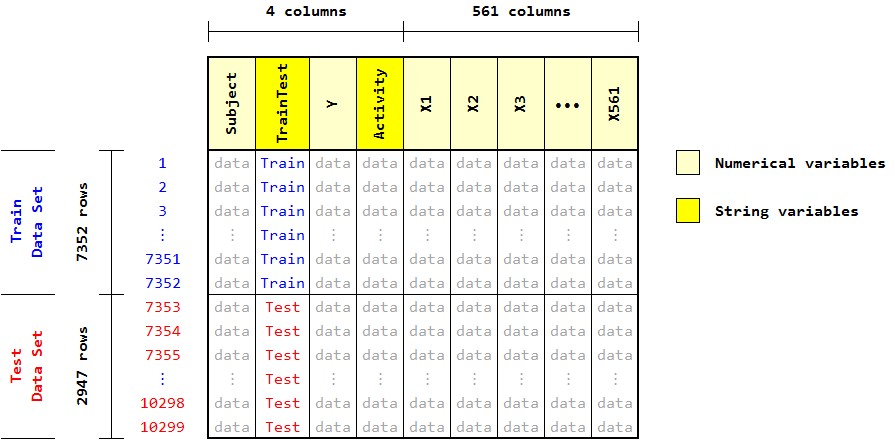
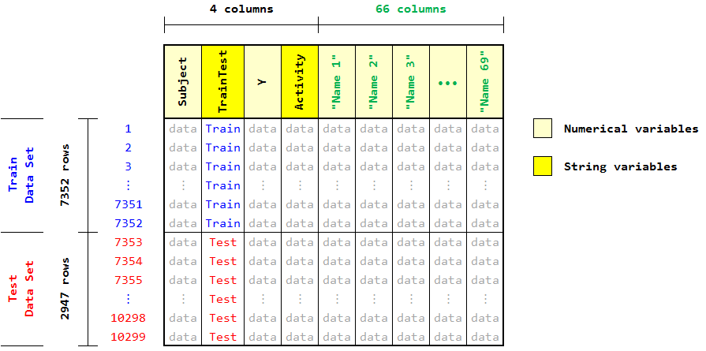
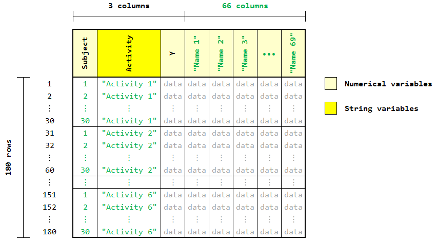

## COURSERA/JHU Data Science Specialization
## Getting and Cleaning Data (May 2015) - Course Project

# Readme

### 1. Repository Contents

This repository contains the following:

 - **README.md**		(this file)
 - Folder **"/UCI HAR Dataset"**(raw data files)
 - **CodeBook.md**		(datasets and variables description)
 - **run_analysis.R**		(master script file)
 - **train_test_datasets.R**	(auxiliary script file)
 - **descriptive_names.txt**	(additional user-defined input file)
 - **Final_Dataset.txt**	(output file)
 - **F1_Dataset.png**		(figure 1)
 - **F2_DatasetMeanStd.png**	(figure 2)
 - **F3_DatasetAveraged.png**	(figure 3)


### 2. File Descriptions and Connections

The folder **"/UCI HAR Dataset"** contains the data files to be processed.

The file **train_test_datasets.R** is an auxiliary script file intended to load the train and test data files and builds two corresponding datasets: **DatasetTrain** and **DatasetTest**.

The file **run_analysis.R** is the master script file. It calls  **train_test_datasets.R** to build the datasets, and then performs all the data processing to build the final tidy dataset with aggregated average values.

The file **descriptive_names.txt** is an input file used by **run_analysis.R** to assign descriptive names to some variables of interest.

All the processings and tranformations performed on the datasets are described in the file **CodeBook.md**.

The three PNG image files are used to illustrate the structure of the main datasets.

The file **Final_Dataset.txt** is the output file containing the final tidy dataset.


### 3. How Do the Script Files Work

When running the master script file **run_analysis.R**, it sources the auxiliary scrip file **train_test_datasets.R** to build two basic datasets: **TrainDataset** and **TestDataset**. Then, the following steps are performed as required from the project instructions:

* Step 1: The datasets **TrainDataset** and **TestDataset** are merged to create a single dataset **DatasetComplete**, with 10299 rows (7352 train observations + 2947 test observations) and 565 columns. See **Figure 1** in the Annexes.

* Step 2: The measurements on the mean and standard deviation for each feature variable in **DatasetComplete** are extracted to a new dataset **DatasetMeanStd**. The regular expression function **grep()** is used to identify the variables in **DatasetComplete** that have names with the words "mean" or "std", and used to subset **DatasetComplete** to generate **DatasetMeanStd**.

* Step 3: The activity labels in file **activity_labels.txt** are used as descriptive names for the activities in dataset **DatasetMeanStd**.

* Step 4: To assign descriptive names to the feature variables in **DatasetMeanStd**, the user-defined text file **descriptive_names.txt** is used.

At this point, **DatasetMeanStd** is a tidy dataset with 10299 observations of 70 variables. See **Figure 2** in the Annexes.

* Step 5: To build the final tidy dataset with *averaged values* of all the variables for each Subject and each Activity, the **aggregate()** function is used on **DatasetMeanStd**, resulting in the final tidy dataset **DatasetAveraged** whose structure is shown in **Figure 3** in the Annexes.

Finally, **DatasetAveraged** is written to a text file **Final_Dataset.txt** using the R function **write.table()**.

**Note:** Since the numerical entries in file **Final_Dataset.txt** have different number of decimal places, the file content is not displayed as a tidy table when openned in a text editor. To confirm that the data in the file is actually tidy, simply load the file into R and check the resulting data frame. The following code can do this:


```r
FinalDataset <- read.table("Final_Dataset.txt", sep="\t", header=TRUE)
head(FinalDataset)
str(FinalDataset)
```

### 4. Remarks

The tidy datasets **DatasetMeanStd** and **DatasetAveraged**, are successfully generated to meet the requirements of Step 4 and Step 5, respectively.

The code book of the project was carefully written to provided detailed information about the data files, datasets and variables processed.

It's important to take in mind that the resulting tidy datasets reflect the personal understanding of the programmer about the project instructions. Different users will certainly build different tidy datasets with essentially the same content variables, but all those datasets must meet the requirement of being tidy.


### 5. Annexes: Structure of the Datasets



**Figure 1**: Structure of the complete dataset **DatasetComplete**.

_


**Figure 2**: Structure of the dataset **DatasetMeanStd**.

_


**Figure 3**: Structure of the final dataset **DatasetAveraged**.

_
